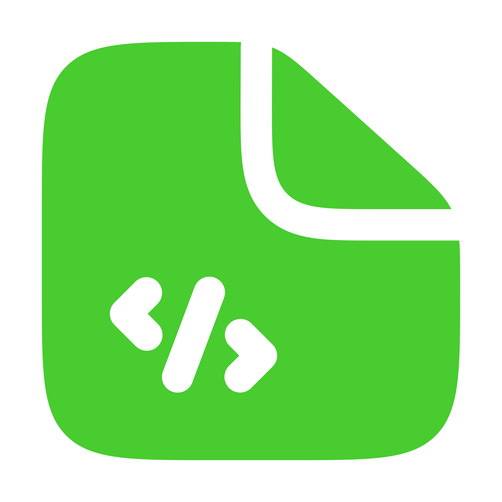
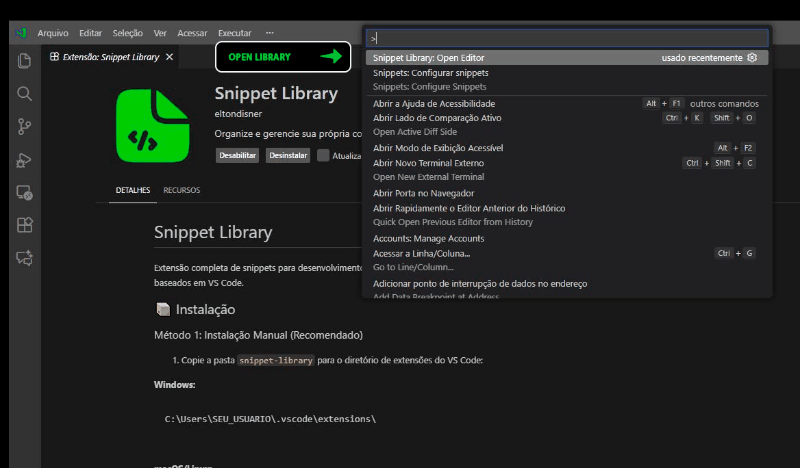

# Snippet Library

Complete snippet extension for web development, created as a replacement for Brackets Snippets for VS Code, Cursor, Windsurf, and other VS Code-based editors.

### Snippet Activation

You can install and activate the extension using one of the following methods:

**Option 1: From .vsix File**
1. Download or locate the `.vsix` file.
2. Open VS Code and go to the **Extensions** view (`Ctrl+Shift+X`).
3. Click the **...** (More Actions) menu in the top-right corner of the Extensions sidebar.
4. Select **Install from VSIX...**.
5. Choose the file to install it.

**Option 2: From install from marketplace**
1. Visit https://marketplace.visualstudio.com/items?itemName=EltonDisner.snippet-library
2. Click on the "Install" button
3. Restart VS Code

# Snippet Library

**Snippet Library** is a powerful extension for Visual Studio Code that allows you to organize, manage, and reuse your code snippets efficiently. Inspired by "Brackets Snippets", it offers an intuitive visual interface to create and edit snippets without having to deal with complex JSON files.

## Main Features

### Visual Snippet Management
- **Add, Edit, and Remove**: Complete graphical interface to manage your snippets.
- **No Manual JSON**: Forget manual editing of `snippets.json` files. Everything is done through user-friendly forms.
- **Organization by Language**: Your snippets are automatically separated by language (PHP, JS, CSS, HTML, etc.).

### Global Snippets
- **Universal Access**: Create snippets in the **GLOBAL** category and they will be available in **any file**, regardless of language.
- Ideal for copyrights, standard comments, or code you use everywhere.

### Quick Search
- **Instant Filter**: Find the snippet you need by typing the name or trigger (prefix) in the search bar.

### Add New Languages
- **Extensible**: Need snippets for Python, Go, or Ruby? Add support for new languages directly through the interface with one click.

### Backup and Restore
- **Security**: Export all your snippets to a JSON backup file.
- **Portability**: Restore your snippets on another machine or share with colleagues easily.

## How to Use

1. Open the command palette (`Ctrl+Shift+P` or `Cmd+Shift+P`).
2. Type **"Snippet Library: Open Editor"**.
3. In the left sidebar:
    - Select the desired language (or **GLOBAL**).
    - Click the **+** button next to the language to add a new snippet.
    - Use the buttons at the top to **Add Language**, **Backup**, or **Restore**.
4. In the editor:
    - Fill in the **Name**, **Prefix** (what you type to call the snippet), **Description**, and the code **Body**.
    - Use `${1}`, `${2}` to define where the cursor will stop (tabstops).

## Shortcuts
- Created snippets automatically appear in VS Code's **IntelliSense**.
- Just type the **prefix** you defined and press `Tab`.

---

**Tip**: Keep your snippets organized and boost your daily productivity!

## Support

If you encounter problems:
1. You may need to restart the editor for new languages and/or snippets to be loaded
2. Check if the extension is in the correct folder
3. Restart VS Code
4. Check if you are editing a file with the correct extension (.php, .html, etc)
5. Check if there is no conflict with other snippet extensions

---

**Developed to replicate the Brackets Snippets experience in VS Code and derivatives**
